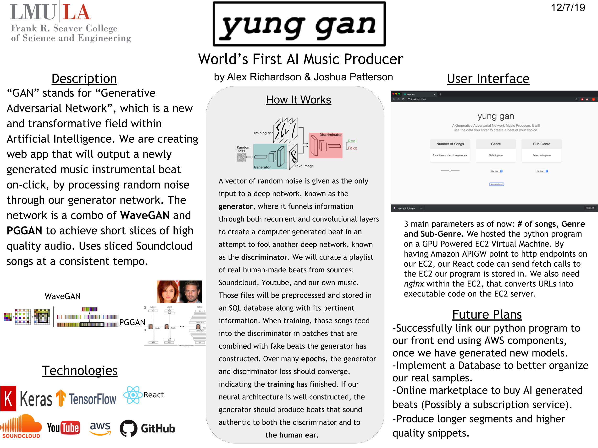

# BeatGAN
### Alex Richardson and Josh Patterson

#### Project Description
` Our software provides a command line application to both generate
music from pretrained models and to train a new model from a .wav or .mp3 music collection.
Our application that will fabricate authentic-sounding hip hop beats through its unique
implementation of a GAN, or Generative Adversarial Network. A vector of random noise is
given as the only input to a deep network, known as the generator, where it funnels information
through both recurrent and convolutional layers to create a computer generated beat in an attempt
to fool another deep network, known as the discriminator. We will curate a playlist of real
human-made beats from sources: Soundcloud, Youtube, and our own music. Those files will be
preprocessed and stored in an SQL database along with its pertinent information. When training,
those songs feed into the discriminator in batches that are combined with fake beats the generator
has constructed. Over many epochs, the generator and discriminator loss should converge,
indicating the training has finished. If our neural architecture is well constructed, the generator
should produce beats that sound authentic to both the discriminator and to the human ear. Our
system will include both a training command-line application written in Python and a generator
command-line application written in Python that uses pre-trained generators included with the
software to produce beats on quick command. A front-end web application is projected to be
created for our command-line software. This will be done by using React.JS, CSS, and HTML.
By having our command-line software run on through AWS GPU Server, an EC2 Virtual
Machine Instance could be created to allow the python program to reach our front-end. Pointing
Amazon API Gateway to a http endpoint on EC2 would allow this to happen.`

#### Project Poster

